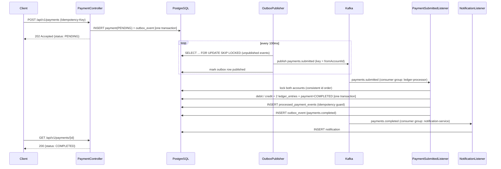

# Architecture

## Flow

## Why it's built this way

**Submission is decoupled from settlement.** `POST /payments` does one small,
fast transaction (insert a PENDING payment + an outbox row) and returns
immediately. It never waits on Kafka, on the other account's lock, or on
however backed-up the consumer is. That's what keeps p95 submission latency
low and roughly constant under load, instead of degrading as throughput
rises.

**Transactional outbox, not a direct Kafka publish from the request thread.**
Writing to Postgres and publishing to Kafka can't be done atomically — they're
two different systems. Publishing directly from the request risks the classic
dual-write bug: the DB commit succeeds but the process crashes before the
Kafka send, and the payment is silently stuck forever with no event ever
published. Instead, the event is written to `outbox_events` in the *same*
transaction as the payment, and a separate poller publishes it. If the
poller crashes mid-batch, unpublished rows are simply picked up again next
poll — at-least-once delivery, by construction.

**Idempotent consumers, because at-least-once means "at least."** A
redelivered `payments.submitted` message (broker retry, consumer rebalance,
a crash between processing and offset commit) must never double-debit an
account. `processed_payment_events` makes "have I already applied this
payment?" an atomic check inside the same transaction as the ledger write,
so a duplicate delivery is a guaranteed no-op.

**Deterministic lock ordering avoids deadlocks, not just races.** A transfer
A→B and a concurrent transfer B→A both need to lock accounts A and B. Locking
in submission order would let one hold A while waiting for B, and the other
hold B while waiting for A — a deadlock. Both transactions instead always
lock the two accounts in the same order — whichever id sorts first per
`UUID.compareTo` — so they queue behind each other in a consistent order
instead of deadlocking. (`UUID.compareTo` isn't naive lexicographic
ordering — it compares the two 64-bit halves as *signed* longs, so which id
"sorts first" isn't always the one that looks smaller as a string. That
surfaced as a genuinely confusing test failure while building this — see the
comment on `PaymentProcessingService` for the detail.)

**Partitioning by source account preserves per-account ordering.** Kafka
only guarantees ordering within a partition. Keying `payments.submitted` by
`fromAccountId` guarantees that if Alice submits two payments in quick
succession, they're processed in the order she submitted them — without
needing a single global ordering across all accounts, which wouldn't scale.

**Two independent consumer groups on the same topics.** `ledger-processor`
posts the ledger; `notification-service` (standing in for a real downstream
notifier) reads the exact same `payments.completed` / `payments.failed`
events under its own group. Kafka fans the events out to both; either one
can be slow, restarted, or fall behind without affecting the other.

## What I'd add next

- A saga / reversal flow for a payment that fails after partially applying
  (not currently possible given the single local transaction, but relevant
  once this spans multiple services).
- Partitioned, horizontally-scaled `OutboxPublisher` instances (the
  `SKIP LOCKED` query is already safe for that; a single poller is enough at
  this scale).
- Rate limiting per account (Redis + a token bucket) ahead of the API layer.
- Metrics/tracing (Micrometer + OpenTelemetry) on the async hop between
  submission and completion, since that latency is invisible to the
  synchronous p95 the load test measures.
